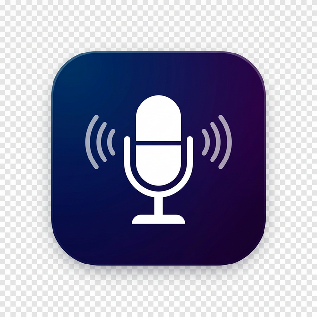

<div align="center">

<!-- Banner -->


<br/>



<br/><br/>

[](https://github.com/Misrilal-Sah/Cursor-Voice-Assistant/releases)
[](https://github.com/Misrilal-Sah/Cursor-Voice-Assistant)
[](LICENSE)
[](https://code.visualstudio.com/)
[](https://github.com/Misrilal-Sah/Cursor-Voice-Assistant/stargazers)

<br/>

> **Speak prompts directly inside VS Code or Cursor — no browser tab, no mic permission pop-ups, no API key required for the default engine.**

</div>

---

## ✨ Features

<table>
<tr>
<td width="50%">

### 🎙️ Native Recording
Uses **Windows Speech Recognition** via `System.Speech` — no Chrome, no browser tab, no firewall rules.

### ⚡ Whisper Mode
Record local WAV with **Windows MCI** → send to OpenAI Whisper for maximum accuracy.

### 🤖 AI Prompt Cleanup
Say "clean prompt" and let **Groq** (llama3-8b, ultra-fast) or **Gemini** polish your transcription before it hits the clipboard.

</td>
<td width="50%">

### 📋 One-Key Workflow
Transcription lands on your clipboard automatically — `Ctrl+L` → `Ctrl+V` → Enter.

### 🔇 Silence Detection
Auto-stops after configurable silence (default 3 s). No manual stop needed.

### 📊 Live Preview Panel
Watch transcription update in real-time inside VS Code — no switching windows.

</td>
</tr>
</table>

| | Feature | Description |
|---|---|---|
| 🧹 | **Prompt Cleanup** | Remove filler words (um, uh, like) + normalise punctuation |
| 🗣️ | **Voice Commands** | "stop recording", "new line", "period", "clear all" |
| 🌍 | **Multi-Language** | EN · HI · ES · FR · DE · JA · KO · ZH · PT · RU · AR · IT |
| 📜 | **Voice History** | Browse & reuse previous 50 transcriptions |
| ✏️ | **Editor Insert** | Drop text at your cursor position instead of clipboard |

---

## 🚀 Quick Start

```
1. Press  Ctrl+Shift+H     →  Recording starts (no browser opens)
2. Speak your prompt       →  Live preview in the Voice Assistant panel
3. Stop speaking           →  Silence auto-stops after 3 s
4. Hit  Ctrl+L  →  Ctrl+V →  Prompt is in Cursor AI chat. Press Enter.
```

### Install from VSIX

```bash
code --install-extension cursor-voice-assistant-0.1.0.vsix
```

### Install from Marketplace

1. `Ctrl+Shift+X` → search **Cursor Voice Assistant** → Install

---

## ⚙️ Configuration

> Open **Settings** (`Ctrl+,`) and search `Voice Assistant`.

### API Keys (all optional)

| Setting | Provider | Get Key |
|---|---|---|
| `voiceAssistant.groqApiKey` | Groq — AI cleanup (fast, free) | [console.groq.com/keys](https://console.groq.com/keys) |
| `voiceAssistant.geminiApiKey` | Gemini — AI cleanup (250 req/day free) | [aistudio.google.com/apikey](https://aistudio.google.com/apikey) |
| `voiceAssistant.whisperApiKey` | OpenAI Whisper — high-accuracy STT | [platform.openai.com/api-keys](https://platform.openai.com/api-keys) |

> **None of these keys are required** for basic use. The default `webSpeechAPI` engine uses Windows Speech Recognition with no key.

### All Settings

| Setting | Default | Description |
|---|---|---|
| `transcriptionEngine` | `webSpeechAPI` | `webSpeechAPI` (Windows) or `whisperAPI` (OpenAI) |
| `aiCleanupProvider` | `groq` | `groq` or `gemini` for the AI cleanup feature |
| `language` | `en-US` | Recognition language |
| `outputMode` | `clipboard` | `clipboard` · `editor` · `both` |
| `autoOpenChat` | `true` | Auto-open Cursor AI chat after transcription |
| `silenceTimeout` | `3` | Seconds of silence before auto-stop (1–30) |
| `enablePromptCleanup` | `true` | Remove filler words (basic, no key needed) |
| `enableVoiceCommands` | `true` | Inline voice commands |
| `showRealtimePreview` | `true` | Live preview in panel |

---

## ⌨️ Keyboard Shortcuts

| Shortcut | Action |
|---|---|
| `Ctrl+Shift+H` / `Cmd+Shift+H` | Toggle recording on / off |

---

## 🗣️ Voice Commands

| Say | Result |
|---|---|
| `"stop recording"` | Stops the session |
| `"new line"` | Inserts `\n` |
| `"period"` | Inserts `.` |
| `"comma"` | Inserts `,` |
| `"question mark"` | Inserts `?` |
| `"exclamation mark"` | Inserts `!` |
| `"clear all"` | Clears the current transcription |

---

## 🛠️ Development

### Prerequisites

- **Node.js** ≥ 18 · **npm** ≥ 9
- **Windows** (native audio uses Windows MCI / System.Speech)
- VS Code or Cursor IDE

### Setup

```bash
git clone https://github.com/Misrilal-Sah/Cursor-Voice-Assistant.git
cd Cursor-Voice-Assistant
npm install
```

### Build & Watch

```bash
npm run build      # one-time production build
npm run watch      # auto-rebuild on save
```

### Run the Extension

1. Open folder in VS Code
2. Press **`F5`** — an Extension Development Host window opens
3. `Output` panel → select `Voice Assistant` channel for live logs

---

## 🧪 Testing

### Manual QA Checklist

#### 1 — Basic recording (`webSpeechAPI`)

| # | Step | Expected |
|---|---|---|
| 1 | Press `Ctrl+Shift+H` | Status bar → **🎤 Recording…**; panel opens |
| 2 | Say "hello world" | Live preview updates |
| 3 | Wait 3 s (silence) | Auto-stops; clipboard contains "hello world" |
| 4 | Press `Ctrl+Shift+H` while recording | Stops immediately |

#### 2 — Whisper API mode

| # | Step | Expected |
|---|---|---|
| 1 | Set engine to `whisperAPI`, add API key | — |
| 2 | Press `Ctrl+Shift+H`, speak, say "stop recording" | Panel: "Recording audio…" |
| 3 | After stop | Panel: "Transcribing with Whisper API…" |
| 4 | Invalid key | Error shown, no crash |

#### 3 — Groq AI cleanup

| # | Step | Expected |
|---|---|---|
| 1 | Set `groqApiKey`, speak "um so basically like fix this bug" | Raw text in review panel |
| 2 | Click **🧹 Clean Prompt** | Groq returns "Fix this bug." |
| 3 | Click **✅ Use Cleaned** | Cleaned text on clipboard |

#### 4 — Voice commands

| Command | Expected |
|---|---|
| "stop recording" | Session stops |
| "new line" | `\n` in output |
| "question mark" | `?` in output |

#### 5 — Edge cases

| Scenario | Expected |
|---|---|
| Speak nothing — silence only | "No speech detected" warning |
| Rapid double `Ctrl+Shift+H` | Only one session starts |
| Groq key invalid | Friendly error; no crash |

---

## 📁 Project Structure

```
src/
├── extension.ts               ← Activation, command wiring, webview
├── statusBar.ts               ← Status bar (idle / recording / processing)
├── outputHandler.ts           ← Clipboard, editor insert, chat open
├── voiceHistory.ts            ← globalState history with QuickPick
├── promptCleanup.ts           ← Filler-word removal (no API key needed)
├── voiceCommands.ts           ← Voice command detection & execution
├── audioPage.ts               ← HTML for optional browser audio page
├── audioServer.ts             ← localhost HTTP + WebSocket server
└── engines/
    ├── engineTypes.ts         ← Interfaces and enums
    ├── windowsSpeechEngine.ts ← Windows System.Speech via PowerShell
    ├── nativeAudioRecorder.ts ← Windows MCI recorder for Whisper mode
    ├── whisperEngine.ts       ← OpenAI Whisper API client
    └── aiPromptCleaner.ts     ← Groq + Gemini AI cleanup
media/
└── icon.png
```

---

## 🔒 Privacy

| Engine | Where data goes |
|---|---|
| `webSpeechAPI` | Processed locally by **Windows Speech Recognition** — stays on your machine |
| `whisperAPI` | Audio sent to **OpenAI API** — key stored in VS Code local settings only |
| Groq AI cleanup | Text sent to **Groq API** — key stored locally only |
| Gemini AI cleanup | Text sent to **Google AI API** — key stored locally only |

**No audio or transcription data is ever stored or transmitted by this extension itself.**

---

## 🤝 Contributing

```bash
git checkout -b feature/your-feature
# make changes
npm run build
# F5 to test
git commit -m "feat: your feature"
git push origin feature/your-feature
# Open a Pull Request
```

---

<div align="center">

<!-- Footer wave -->


Made with ❤️ by [Misrilal Sah](https://misril.dev/) &nbsp;·&nbsp; [MIT License](LICENSE) &nbsp;·&nbsp; [Report a Bug](https://github.com/Misrilal-Sah/Cursor-Voice-Assistant/issues)

</div>


# 🎤 Cursor Voice Assistant

**Speak to your IDE.**

Capture microphone input directly inside VS Code / Cursor using Windows built-in speech recognition — transcribed text lands on your clipboard, ready to paste into Cursor AI chat.

[](https://github.com/Misrilal-Sah/Cursor-Voice-Assistant/releases)
[](https://github.com/Misrilal-Sah/Cursor-Voice-Assistant)
[](LICENSE)
[](https://code.visualstudio.com/)

</div>

---

## ✨ Features

| | Feature | Description |
|---|---|---|
| 🎙️ | **No-browser recording** | Uses Windows Speech Recognition via `System.Speech` — no Chrome tab needed |
| ⚡ | **Whisper API mode** | Record WAV with Windows MCI → send to OpenAI for high-accuracy transcription |
| 📋 | **Clipboard output** | Transcription copied automatically — paste into any chat with `Ctrl+V` |
| 🤖 | **Auto-open Cursor chat** | Opens AI chat panel after transcription completes |
| ✏️ | **Editor insert mode** | Drop text directly at your cursor position |
| 🔇 | **Silence detection** | Auto-stops after configurable silence (default 3 s) |
| 🧹 | **Prompt cleanup** | Strips filler words (um, uh, like) and normalises punctuation |
| 🗣️ | **Voice commands** | "stop recording", "new line", "period", etc. |
| 🌍 | **Multi-language** | EN, HI, ES, FR, DE, JA, KO, ZH, PT, RU, AR, IT |
| 📜 | **Voice history** | Browse & reuse previous transcriptions |
| 📊 | **Live preview panel** | Watch transcription appear in real-time inside VS Code |

---

## 🚀 Getting Started

### Install from VSIX

```bash
code --install-extension cursor-voice-assistant-0.1.0.vsix
```

### Install from Marketplace

1. Open the Extensions view — `Ctrl+Shift+X`
2. Search **Cursor Voice Assistant**
3. Click **Install**

### Quick Start

```
1.  Press  Ctrl+Shift+H          →  Recording starts
2.  Speak your prompt             →  See it live in the panel
3.  Stop speaking (or say "stop recording")
4.  Transcription is on clipboard →  Ctrl+L → Ctrl+V → Enter
```

---

## ⚙️ Configuration

Open **Settings** → search `Voice Assistant`.

| Setting | Default | Description |
|---|---|---|
| `transcriptionEngine` | `webSpeechAPI` | `webSpeechAPI` (Windows Speech) or `whisperAPI` (OpenAI) |
| `whisperApiKey` | *(empty)* | OpenAI API key — only needed for Whisper mode |
| `language` | `en-US` | Recognition language |
| `outputMode` | `clipboard` | `clipboard` · `editor` · `both` |
| `autoOpenChat` | `true` | Auto-open Cursor AI chat after transcription |
| `silenceTimeout` | `3` | Seconds of silence before auto-stop (1–30) |
| `enablePromptCleanup` | `true` | Remove filler words |
| `enableVoiceCommands` | `true` | Enable inline voice commands |
| `showRealtimePreview` | `true` | Live transcription in the panel |

### Using Whisper API (Higher Accuracy)

```
Settings → Voice Assistant → Transcription Engine → whisperAPI
Settings → Voice Assistant → Whisper API Key → <your OpenAI key>
```

---

## ⌨️ Keyboard Shortcuts

| Shortcut | Action |
|---|---|
| `Ctrl+Shift+H` / `Cmd+Shift+H` | Toggle recording on / off |

---

## 🗣️ Voice Commands

| Say | Result |
|---|---|
| `"stop recording"` | Stops the current session |
| `"new line"` | Inserts a line break (`\n`) |
| `"period"` | Inserts `.` |
| `"comma"` | Inserts `,` |
| `"question mark"` | Inserts `?` |
| `"exclamation mark"` | Inserts `!` |
| `"clear all"` | Clears the current transcription |

---

## 🛠️ Development

### Prerequisites

- **Node.js** ≥ 18
- **npm** ≥ 9
- **Windows** (native audio uses Windows MCI / System.Speech)
- VS Code or Cursor IDE

### Setup

```bash
git clone https://github.com/Misrilal-Sah/Cursor-Voice-Assistant.git
cd Cursor-Voice-Assistant
npm install
```

### Build & Watch

```bash
# One-time production build
npm run build

# Watch mode — auto-rebuilds on every save
npm run watch
```

### Run in Extension Development Host

1. Open the folder in VS Code
2. Press **`F5`** — a new VS Code window opens with the extension loaded
3. The **Output** panel → `Voice Assistant` channel shows live logs

---

## 🧪 Testing

### How to run tests

```bash
# Lint only (no test runner yet — see below)
npm run lint
```

> Unit tests are not scaffolded yet. The sections below describe **manual QA** that should pass before any release.

---

### What to test — Manual QA Checklist

#### 1. Basic recording — `webSpeechAPI` mode

| # | Step | Expected |
|---|---|---|
| 1 | Press `Ctrl+Shift+H` | • Status bar shows **🎤 Recording…** • Panel opens with "Listening for speech…" |
| 2 | Say "hello world" | • Live preview shows the text • Status badge pulsing red |
| 3 | Wait 3 s (silence) | • Recording stops automatically • Status bar → Processing → Idle |
| 4 | Check clipboard | • `hello world` (or cleaned version) in clipboard |
| 5 | Press `Ctrl+Shift+H` again while recording | • Recording stops immediately |

#### 2. Whisper API mode

| # | Step | Expected |
|---|---|---|
| 1 | Set engine to `whisperAPI`, add valid API key | — |
| 2 | Press `Ctrl+Shift+H`, speak 5 s, say "stop recording" | • Panel shows "Recording audio — click Stop when done…" |
| 3 | After stop | • Panel shows "Transcribing with Whisper API…" |
| 4 | Result | • High-accuracy transcription on clipboard |
| 5 | Invalid API key | • Error message shown — no crash |

#### 3. Prompt cleanup

| # | Step | Expected |
|---|---|---|
| 1 | Speak "um so basically like fix this bug" | Raw text preserved in review panel |
| 2 | Click **🧹 Clean Prompt** | Cleaned: "Fix this bug." |
| 3 | Click **✅ Use Cleaned** | Cleaned text sent to clipboard |

#### 4. Voice commands

| Command | Expected |
|---|---|
| "stop recording" | Recording stops |
| "new line" | Output contains `\n` |
| "period" | Output ends with `.` |
| "question mark" | Output ends with `?` |

#### 5. Output modes

| Mode | Expected |
|---|---|
| `clipboard` | Text in clipboard; notification shown |
| `editor` | Text inserted at cursor in active editor |
| `both` | Both of the above |

#### 6. Voice history

| Step | Expected |
|---|---|
| Run 3 transcriptions | — |
| Command palette → "Voice Assistant: Show Voice History" | QuickPick shows 3 entries, newest first |
| Select entry | Re-copied to clipboard; confirmation toast shown |

#### 7. Edge cases

| Scenario | Expected |
|---|---|
| No speech at all — silence only | "No speech detected" warning; no crash |
| `Ctrl+Shift+H` rapid double-press | Only one recording session starts |
| Whisper mode with no internet | Helpful error message — no crash |
| Panel closed mid-recording | Recording continues; output still works on completion |

---

## 📁 Project Structure

```
src/
├── extension.ts          # Activation, command registration, wiring
├── statusBar.ts          # Status bar item (idle / recording / processing)
├── outputHandler.ts      # Clipboard, editor insert, chat open
├── voiceHistory.ts       # globalState-backed history with QuickPick
├── promptCleanup.ts      # Filler-word removal, punctuation normalisation
├── voiceCommands.ts      # Voice command detection & execution
├── audioPage.ts          # HTML for the optional browser audio page
├── audioServer.ts        # localhost HTTP + WebSocket server (legacy browser path)
└── engines/
    ├── engineTypes.ts         # Interfaces and enums
    ├── windowsSpeechEngine.ts # Windows System.Speech via PowerShell
    ├── nativeAudioRecorder.ts # Windows MCI audio recorder for Whisper mode
    └── whisperEngine.ts       # OpenAI Whisper API client
media/
└── icon.png              # Extension icon
```

---

## 🔒 Privacy

| Engine | Where audio goes |
|---|---|
| `webSpeechAPI` | Processed locally by Windows Speech Recognition — stays on your machine |
| `whisperAPI` | Sent to OpenAI's API. Your key is stored in VS Code's local settings only |

No audio or transcription data is ever stored or transmitted by this extension itself.

---

## 🤝 Contributing

```bash
# Fork → clone → branch
git checkout -b feature/your-feature

# Make changes, then
npm run build
# Test with F5 in VS Code

git commit -m "feat: your feature"
git push origin feature/your-feature
# Open a Pull Request on GitHub
```

---

## 📄 License

[MIT](LICENSE) © [Misrilal Sah](https://misril.dev/)


